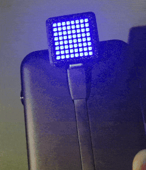

# ⚡ ESP32 Tempo Matrix Display

<div align="center">
  
</div>

 

Un affichage connecté sur matrice LED 8x8 qui indique la couleur du jour de l'offre **EDF Tempo** (Bleu, Blanc, Rouge). Ce projet utilise un ESP32-S3 et intègre une fonctionnalité interactive **"Shake to Refresh"** grâce à l'accéléromètre intégré.

## 🌟 Fonctionnalités

* **Connexion WiFi & API :** Récupère automatiquement la couleur du jour via l'API [api-couleur-tempo.fr](https://www.api-couleur-tempo.fr/).
* **Affichage Visuel :**
    * 🟦 **Bleu :** Jours économiques.
    * ⬜ **Blanc :** Jours moyens.
    * 🟥 **Rouge :** Jours chers (pic de consommation).
    * 🟪 **Violet/Orange :** Indication d'erreur (WiFi ou API).
* **Shake to Refresh 👋 :** Secouez le boîtier pour forcer une mise à jour immédiate (détection via capteur QMI8658).
* **Mise à jour automatique :** Rafraîchissement automatique toutes les heures si aucun mouvement n'est détecté.
* **Animations :** Effet "Radar" progressif en vert lors du chargement des données.

## 🛠 Matériel Requis

* **ESP32-S3 Matrix** (Type Waveshare ou générique)
    * *Doit inclure une matrice RGB 8x8 (WS2812B)*
    * *Doit inclure le capteur IMU QMI8658*
* Câble USB-C (Data + Power)

## ⚙️ Configuration Technique

### Broches (Pinout)
Ce projet est configuré pour les cartes ESP32-S3 Matrix standard :

| Composant | Pin ESP32 (GPIO) | Notes |
| :--- | :--- | :--- |
| **Matrice LED** | `GPIO 14` | WS2812B / NeoPixel |
| **I2C SDA** | `GPIO 11` | Pour le capteur QMI8658 |
| **I2C SCL** | `GPIO 12` | Pour le capteur QMI8658 |

### Bibliothèques Arduino requises
Installez les bibliothèques suivantes via le Gestionnaire de bibliothèques (Ctrl+Shift+I) :

1.  **FastLED** (by Daniel Garcia) - *Gestion des LEDs*
2.  **ArduinoJson** (by Benoit Blanchon) - *Parsing de la réponse API*
3.  **SensorLib** (by Lewis He) - *Gestion de l'accéléromètre QMI8658*

## 🚀 Installation

1.  Clonez ce dépôt ou téléchargez le fichier `.ino`.
2.  Ouvrez le projet dans **Arduino IDE**.
3.  Modifiez les identifiants WiFi au début du fichier :
    ```cpp
    const char* ssid = "VOTRE_SSID";
    const char* password = "VOTRE_MOT_DE_PASSE";
    ```
4.  Sélectionnez la carte :
    * **Type de carte :** `ESP32S3 Dev Module`
    * **USB CDC On Boot :** `Enabled` (Important pour le débogage Série)
5.  Téléversez le code !

## 📐 Personnalisation

* **Sensibilité de la secousse :** Ajustez la variable `float SEUIL_SECOUSSE = 1.3;` (1.3g). Augmentez cette valeur si le système est trop sensible.
* **Luminosité :** Modifiez `#define BRIGHTNESS 30` (0-255). *Attention : le Blanc consomme beaucoup d'énergie, évitez de dépasser 50 sur port USB.*

## 🤝 Crédits

* Données fournies par [api-couleur-tempo.fr](https://www.api-couleur-tempo.fr/).
* Inspiré par la communauté Arduino & ESP32.
